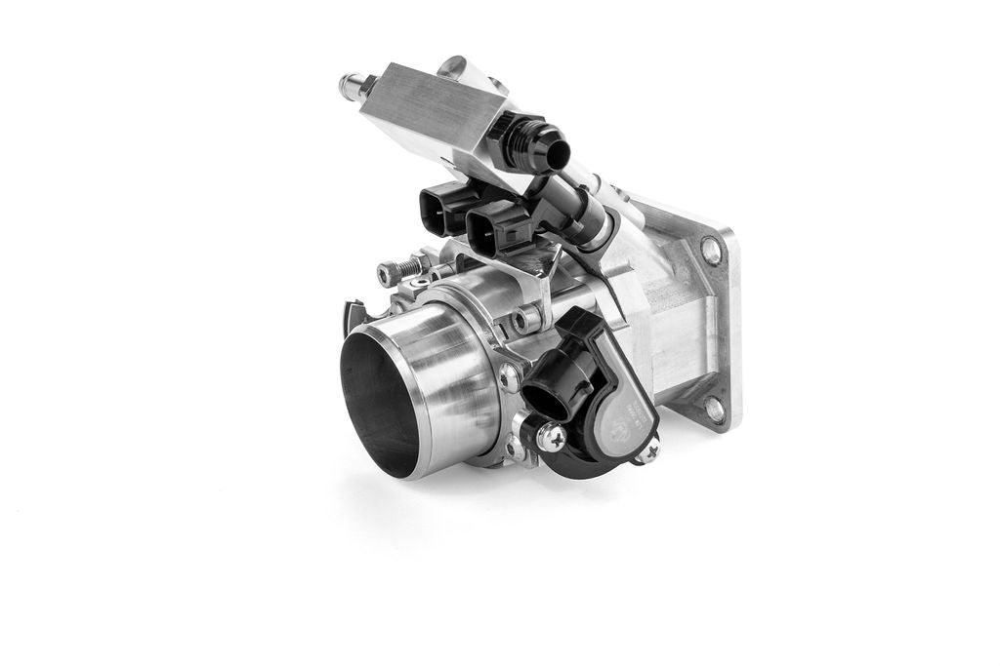
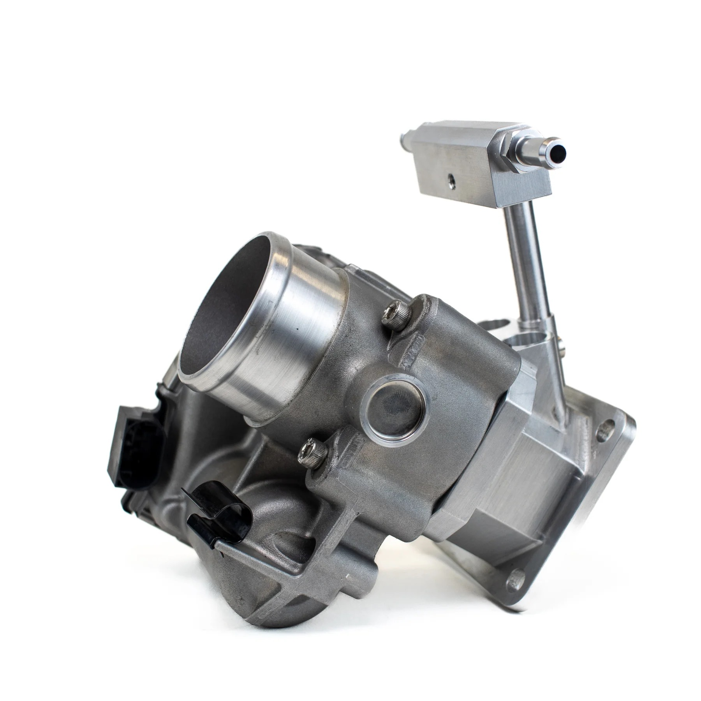
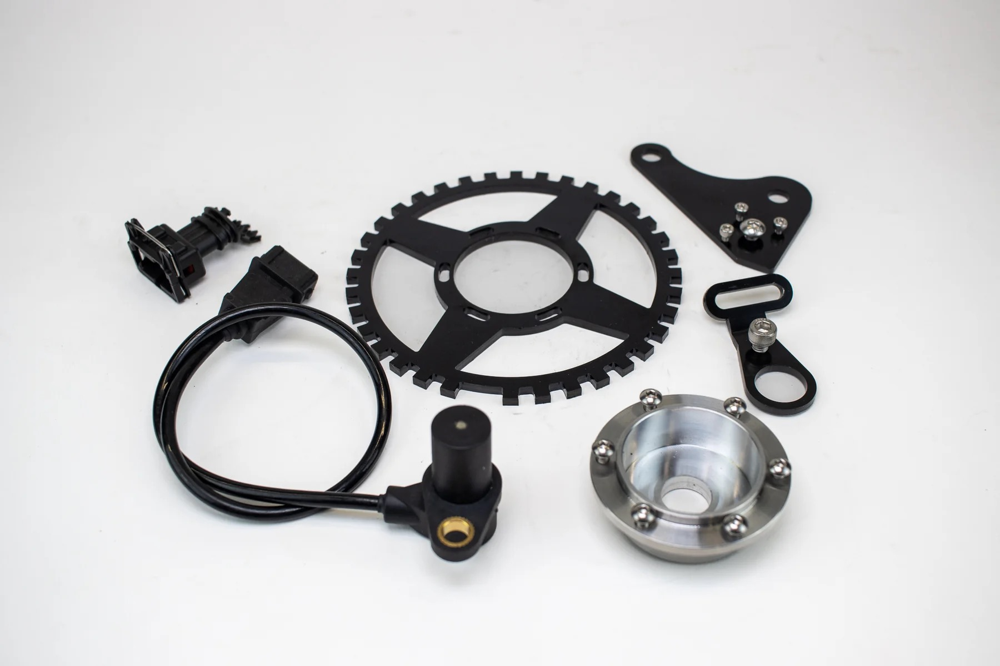
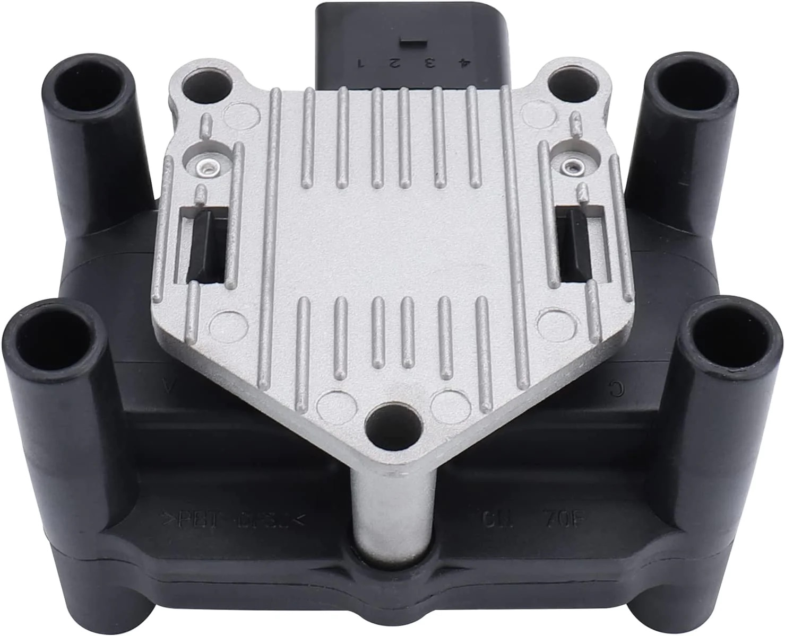
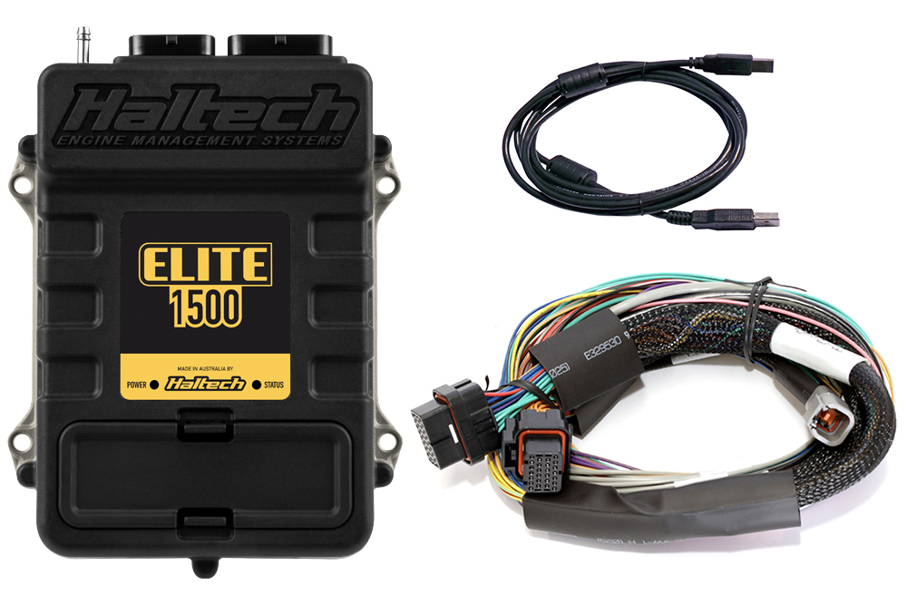

<!-- Content of the page -->

# Classic Mini Fuel Injection

It's been some time since I released the Classic Mini DIY fuel injected throttle body line on my store. If you haven't seen those yet, I would suggest you go take a look! I have taken it upon myself to start working towards modernizing my Classic Mini and sharing my experience with the world on how you may be able to do that with your cars.

Below you will find a (relatively) comprehensive list to the parts and things you may need to accomplish this on your own car. So strap in and get ready. Its time to learn about EFI and the Classic Mini.

<!--more-->

## Why would I want to fuel inject my old Mini?

This is a question receive alot in relation to this type of project.

* Whats wrong with the carb?
* Whats the point?
* Why would you want to put all those wires in there?
* And on, and on...

The truth is **_a carb is the simplest way to run your car_**. That said it is far from the most reliable, most efficient, and highest performing way to run your car. A whole technical article could be written purely on why EFI is objectively better than a carburettor in almost every way but we wont get too far into that in this article.

### Fuel injection will solve a few primary things

* **Optimize fueling** so you are always burning as efficiently as possible
* **Control your timing** to pull out all the horsepower in your engine
* **Increase reliability** as it scales with weather conditions
* **Decrease failure points** (yes I know this is counter-intuative)

---

# What do I need to fuel inject my Mini?

With that background out of the way, lets get into the meat and potatoes. What exactly will you need to fuel inject your mini, and where can you get it? Some items below are offered directly on my store, while others are items you must source yourself. I will do my best to make this as easy as possible. But should you have any questions feel free to reach out [classicminidiy@gmail.com](mailto:classicminidiy@gmail.com)

## EFI Carburettor Replacement - EFI Throttle Body

The first thing you will need is a way to delivery fuel, and manage your throttle opening. This is the most mechanically complicated portion of the conversion process and will directly replace your carburettor. For this, there are two primary options that will directly bolt on.

_Note: I will not be covering cross-flow cylinder heads or their fuel injection throttlebodies in this article._

### Option 1 - Cable Driven Throttle Body

The simplest solution is to install a cable driven throttlebody. This will provide you the ability to easily connect your existing throttle cable. This simplifies the swap but doesnt yield all the advanced features that option 2 provides such as idle control, cruise control, and more. Classic Mini DIY offers the most affordable CNC unit on the market. It comes with a built in Throttle Position Sensor and the wiring pigtail to connect it to your ECU.

> Order yours here: [CMDIY Cable Throttlebody](https://store.classicminidiy.com/collections/engine-management-and-fuel-injection/products/efi-throttle-body-hif44-replacement)

### Option 2 - "Drive by Wire" Throttle Body

The more advanced but significantly more feature rich solution is a Drive by Wire setup. This would require an electronic pedal and an ECU that supports this setup. However the benefits of this setup include things like full automatic idle control, launch control, cruise control, custom throttle curves and more.

> Order yours here: [CMDIY Drive by Wire Throttlebody](https://store.classicminidiy.com/collections/engine-management-and-fuel-injection/products/drive-by-wire-throttle-body-hif44-replacement)

## Crank Position Sensor

After the throttlebodies, the next important piece of hardware will be your Crankshaft Position Sensor. This small sensor and bracket system will tell your ECU where your engine is in its rotation. This is absolutely essential for your ECU to properly understand when to fire the spark plugs.

> Order yours here: [Classic Mini DIY Crank Sensor Kit](https://store.classicminidiy.com/collections/engine-management-and-fuel-injection/products/36-1-trigger-kit)

## Coilpack Ignition Coil

In a distributor systel your distributor combined with ignition coil handles the job of firing your spark plugs. With a fuel injection system you need something a bit more sophisticated to get the job done. That is where the **Coilpack** comes in. This gets connected to your ECU and allows uniform and reliable firing of your spark plugs using its built in ignitor.

> Order yours here: [Bosch VW Coilpack](https://amzn.to/3Oh4osP)

## The ECU (Engine Control Unit)

With the large variety of ECU's on the market, **Which ECU should I get?** is the question I get asked the most. The short answer to this question is, "The one that offers you all the features you need for your setup". However this answer is obviously not very helpful. So below I have put together a table of ECU's and the features they offer compared to what you may need for your setup. All the ECU's below will run an A-Series engine with varying degrees of complexity.

| Brand                 | Model      | DBW | Support     | Base Map Avialable |
| --------------------- | ---------- | --- | ----------- | ------------------ |
| Haltech               | Elite 750  | ❌   | Exceptional | Yes                |
| Haltech               | Elite 1500 | ✅   | Exceptional | Yes                |
| Haltech               | Nexus R3   | ✅   | Exceptional | Yes                |
| Emerald               | K6         | ❓   | Exceptional | Yes                |
| Speeduino             | DIY        | ✅   | DIY Only    | Yes                |
| MegaSquirt            | DIY        | ✅   | DIY Only    | Yes                |
| Specialist Components | Delta 400  | ❌   | Poor        | No                 |
| Specialist Components | Delta 700  | ✅   | Poor        | No                 |

Now this is not a comprehensive list of every ECU on the market. But these are the common ECU's I see people using in their Minis these days. My top pick for the Classic Mini owner is by far the **Haltech Elite 1500 with Wiring Harness**. This will sort out almost every EFI conversion I come across and they offer unparalleled support for their hardware via phone/email/chat.

> Order yours here: [Halech Elite 1500](https://www.haltech.com/product/ht-150902-elite-1500/)

[Back to Blog](/blog)
